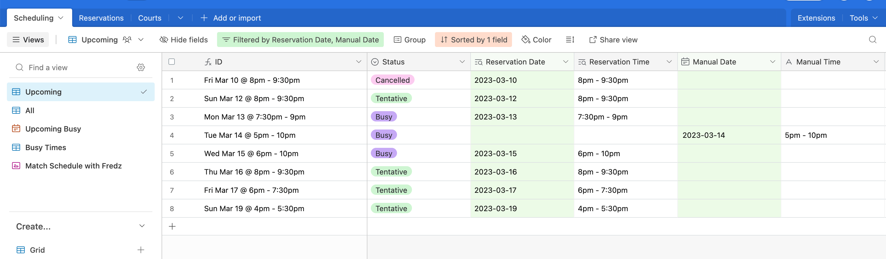
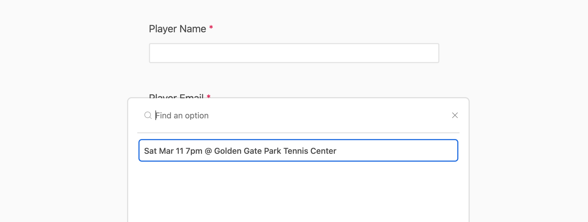
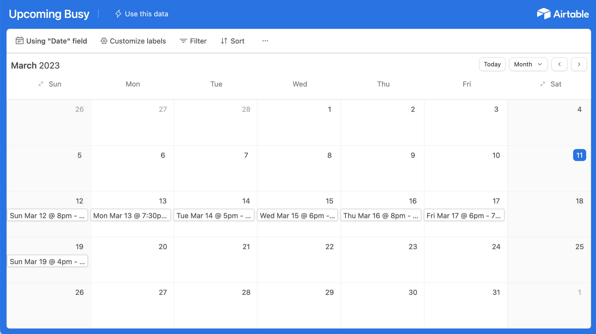
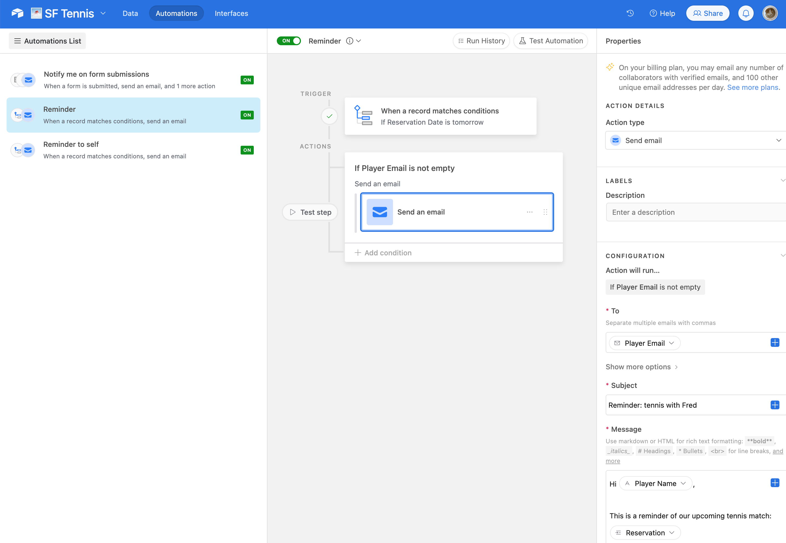

As I described in [part 1](airtennis-part-1-of-3-challenges-of-scheduling-tennis-in-sf), it's
very tedious to manage court reservations and tennis schedules manually. This post will cover
my solution.

<h2 id="overview">Airtennis: a simple and free Calendly alternative</h2>

To give the tool a name, let's call it **Airtennis**: an Airtable-based tennis scheduling tool. If
you're familiar with Calendly as a calendar scheduling tool, this is very similar:

1. I add a list of Reservations of courts I've booked in the city for the upcoming week
2. I send my opponents a URL to an Airtable form, where they can see the time and location of
   each Reservation, and claim an open slot
3. The form now updates live to remove that slot from other players

Now, instead of spending a lot of overhead time to coordinate, I let my prospective opponents book a
time first-come-first-serve style. Sound easy? Let's see how this works in detail.

<h3 id="owner-view">
  Owner view: track reservations, send to opponents, see upcoming schedules
</h3>

As the owner of an Airtennis calendar, I just need to do two tasks:

**Task 1: add Reservations**

To do this, I use two lists in Airtennis: one called "Courts" to track the information of several
local courts, and one called "Reservations" to list any reservations I was able to book.

Since every "Reservation" is at a specific court location, I can reuse the "Courts" I've populated
over time. In Airtable, this reuse is done using a "Linked Record", which borrows from a database
concept of a "foreign key constraint".

In practical and plain English, this just means that every time I book a reservation at "Golden
Gate Park Tennis Courts", I can quickly it to my new reservation with just 1 keystroke
("G[...olden Gate]"). The rest of the name, court address, and helpful information like "Does it
have lights for playing at night?" will all be populated and kept up-to-date.

**Task 2: see upcoming Schedules**

It takes (at least) 2 people to play tennis, so just having Reservations is not enough. The next
list is all the Schedules where another person is confirming that they want to play.

This list is populated by one of two ways: someone joins my Reservation (elaborated in Task 3),
or when I get invited to play by someone else with their own court reservation, and I add to it
myself:

1. The first case will be done by my opponents. This will reuse the information from the Reservation
   to include its date and time, as another example of using the "Linked Record" function.
2. The second case will be done by me. Since the other person's reservation is not inside my system,
   I'll need to add the date, time, and location manually myself

As a result, the Schedules list will show me all of the matches coming up, whether or not I made the
reservation for them.

<h3 id="opponents-view">
  Opponents' view: my availabilities and busy times
</h3>

Now, I'm ready to send something over to my opponents to help with the first case of scheduling.

**Task 3: send a sign-up form to opponents**

Last but not least, I send an Airtable form to the prospective opponents. The form is set up so that
it only shows Reservations which do NOT have a Schedule associated yet, which ensures that none of
my Reservations will get double-booked.

(Note that this date does NOT appear in the "Schedules" list from Task 2 quite yet, since nobody has
booked this slot yet.)

Also, thanks to my system tracking all of my matches so far, I can also send a redacted schedule to
those opponents. This helps them avoid suggesting a time slot that I'm already committed to play
another match.

<h3 id="auto-reminders">
  Bonus feature: auto reminders
</h3>

Finally, as a bonus, Airtable also has an Automations feature to set up some automatic reminders. I
have several different ones set up:

1. Email me when someone fills out my form
2. Email myself and my opponent a day before our scheduled match

That's it! If this sounds like something you'd like to try, check out
[part 3](airtennis-part-3-of-3-set-up-your-own-airtable-base) to see how you
can replicate this same setup in your own Airtable account.
