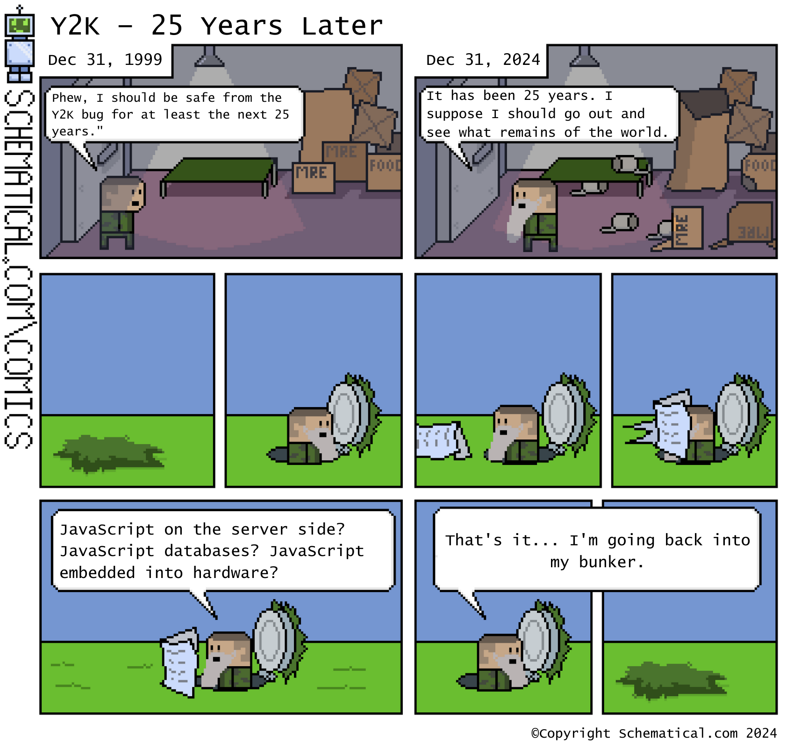

Recently I talked to other software engineers looking to build some simple apps, and recommended
RedwoodJS as a simple starting point (based on [this earlier post](/app-building-in-2023-2024)).

As I was sending it to people who may have never written production JavaScript, I realized that
there were quite a few decisions to make and understand... many of which I didn't *really*
understand myself either! And that's despite working in JavaScript at Facebook and Airtable over my
career -- the last 4+ quite deeply, since Airtable is on a [fullstack JavaScript
codebase](https://medium.com/airtable-eng/612c008baf5c).

So, this post is an attempt to dive deeply into the state of JavaScript development now in 2025, the
way I wish I got introduced to it all.

## Assumptions for reading this post

This post is aimed at someone building a **fullstack web application**, with a basic understanding
of programming and other languages like Python, but not (yet) much experience in JavaScript
development (abbreviated "JS" below).

As we go through each section, I'll focus on a decision, and answer three questions:

1. 🤷 What's the reason this decision exists?
2. ⚡️ What's a simple recommendation for a new greenfield project today?
3. 🤓 Why does it actually matter? What alternatives are there?

The first question is the most important, but the other two help cater to your specific needs. When
you are starting a new greenfield project, you'll have more control on the decision itself; when you
join an existing one, it's usually more realistic to go with a pre-existing decision and move on,
but you'll still benefit from understanding its context.

(For example, RedwoodJS made *some* similar decisions, but many different ones, just due to its
nature as an existing project.)

## <a id="summary"></a> Summary

| Section/Decision | ⚡️ Recommendation for new projects | 🤷 🤓 Details |
| --- | --- | --- |
| **1. Make it work/** | [Go to section](#level-1) |
| 1.1: Development runtime | `node` at v22 | [Read more](#development-runtime) |
| 1.2: Package manager | `pnpm` | [Read more](#package-manager) |
| 1.3: Module type | ES Module | [Read more](#module-type) |
| 1.4: Backend server | Nothing, or `fastify` | [Read more](#backend-server) |
| 1.5: Frontend web bundler | `vite` | [Read more](#frontend-web-bundler) |
| 1.6: Frontend UI | `react` at v18.3 | [Read more](#frontend-ui) |
| **2. Make it right/** | [Go to section](#level-2) |
| 2.1: Typing and TypeScript | Yes, use TypeScript | [Read more](#typing-typescript) |
| 2.2: Target version | `es2022` | [Read more](#target-version) |
| 2.3: Linting | `typescript-eslint` | [Read more](#linting) |
| **3. Make it fast/** | [Go to section](#level-3) |
| 3.1: Formatting | `prettier` | [Read more](#formatting) |
| 3.2: UI Styling | TailwindCSS and Flowbite | [Readmore](#ui-styling) |
| 3.3: Client \<-> server protocol | GraphQL | [Read more](#client-server-protocol) |
| 3.4: Database ORM | `prisma` | [Read more](#database-orm) |
| 3.5: Testing framework | Jest and Storybook | [Read more](#testing-framework) |

### <a name="editor"></a>Decision 0.1: Editor

Before diving into JS development, you'll need to set up your editor. If you already have a favorite
editor, keep using it!

But if not, [Visual Studio Code](https://code.visualstudio.com/) has lots of good integrations with
other decisions that will appear later, so you can get to effective coding faster with relatively
low setup cost.


## <a id="level-1"></a> [Level 1] Make it work

In the first level, we'll examine the most basic decisions to start writing JavaScript code. The
code will "work" in the sense that it will run, but it may not be the most efficient or effective to
keep building on quite yet. Level 2 will help with that part instead.

### <a name="development-runtime"></a>Decision 1.1: Development Runtime

**🤷 What's the reason this decision exists?**

JavaScript actually has many options for the runtime, its version, and how to install it all. We
need to make this first decision before doing anything else.

**⚡️ What's a simple recommendation on a new greenfield project today?**

**Node v22 installed using nvm**. The below instructions come from
[nvm](https://github.com/nvm-sh/nvm?tab=readme-ov-file#installing-and-updating) and
[corepack](https://github.com/nodejs/corepack?tab=readme-ov-file#default-installs):

```shell
# The following just needs to be run once globally, not per-project
$ curl -o- https://raw.githubusercontent.com/nvm-sh/nvm/v0.39.0/install.sh | bash
$ nvm install 22
$ corepack enable
# Now, start a project folder my-project-2025 and use it
$ mkdir my-project-2025
$ cd my-project-2025
$ nvm use --save 22
```

**🤔 Why does it matter? What alternatives are there?**

I do rely on an assumption that we are either happily or begrudgingly choosing JS. Without that
assumption, language *choice* for the backend is worth a post itself, and something I'll admit to
not have tried to fully understand yet.

While having "one" language (ignoring the "target versions" decision in [a bit](#target-version)!)
isn't necessarily the best decision-making factor, it's certainly a helpful simplification to make
when starting out, before we see other factors arise (e.g. performance).



_via [Schematical](https://schematical.com/posts/y2k-25-years-later_2024-12-31)_

Within JS, several runtime options exist today (`node, deno, bun`). I recommend `node` purely from
its long-established usage, even though `deno` was [made by the same creator trying to rectify
its mistakes in security and ergonomics](https://www.youtube.com/watch?v=M3BM9TB-8yA) and `bun` has
some impressive benchmarks on speed. (With [Deno 2.0](https://deno.com/blog/v2.0) recently announced
in October 2024, I think all are worth keeping an eye on for the future.)

Node has different versions (just like Python, Rust, etc.), and the packages you want to use may
target a minimum requirement `node` version that necessitates a higher one than what your machine
currently has installed... or a lower one. So, `nvm` helps quickly switch between versions. This
also helps resolve seemingly random permission issues that may arise from otherwise installing
`node` globally, as explained in [this StackOverflow
question](https://stackoverflow.com/questions/73156323/internal-error-eacces-permission-denied-symlink-lib-node-modules-corepack).

The choice for `node v22` in 2025 is simply because it's new enough to be officially well-supported
(as the current Long Time Support edition), but not so new that there are still bugs to be ironed
out.

Finally, run `corepack enable` and `nvm use --save 22` to allow packages to specify their package
managers and node versions, which will be elaborated [a bit later](#package-manager) too.

### <a name="package-manager"></a>Decision 1.2: Package Manager

**🤷 What's the reason this decision exists?**

You'll almost never build purely from scratch, and instead usually use libraries (packages) that
others have published. `node` ships with a package manager `npm`, which is both a tool and a
registry, but there are many alternatives to both.

**⚡️ What's a simple recommendation on a new greenfield project today?**

**pnpm**, with both its [installation steps](https://pnpm.io/installation) and 2 extra commands:

```shell
$ corepack enable pnpm
$ corepack use pnpm
$ pnpm init
$ pnpm install
```

**🤔 Why does it matter? What alternatives are there?**

In addition to `npm`, `pnpm` and `yarn` are other package managers with a lot of traction.

`pnpm` is mature enough, benefits from [efficient disk usage](https://pnpm.io/motivation), and has
good dependency and workspace management. It installs from the [NPM registry](https://npmjs.com),
but [JSR](https://jsr.io/) is another alternative that's also compatible with Deno and Bun.

Regardless of which package manager you use, one overaching goal is [reproducible
builds](https://fossa.com/blog/three-pillars-reproducible-builds/) no matter which computer is
running your project and who might try to run it in the future. Running `pnpm init` and `pnpm
install` will record the package manager and version to help further lock in a reproducible build.

### <a name="module-type"></a>Decision 1.3: Module Type

**🤷 What's the reason this decision exists?**

There are two sub-decision here:

* Type of the module for my own project, as defined by a Node project's `package.json`
* Type of the module I want to use/import

**⚡️ What's a simple recommendation on a new greenfield project today?**

**ES Module** for own project, by updating `package.json`:
```json
{
  "name": "...",
  "type": "module",
  ...
}
```

and either type for importing other modules.

**🤔 Why does it matter? What alternatives are there?**

This [article by Devlin Glasman on Modules and
Bundling](https://8thlight.com/insights/a-history-of-javascript-modules-and-bundling-for-the-post-es6-developer)
is a relevant read that explains the difference between CommonJS and ES Modules.

The recommendation for ES Module is for the first consideration ("my own project"), since it's the
direction of the future, and can also easily import CommonJS modules.

The reverse for importing was not true for a while: CommonJS projects could not easily reuse ES
Modules. And today, many packages publish as ES Modules only, with many of them linking to [this
disclaimer](https://gist.github.com/sindresorhus/a39789f98801d908bbc7ff3ecc99d99c). But there seems
to be some good news: if you *have* to use CommonJS as the module system for your project, you may
be able to take advantage of [a relatively recent feature in node v22 by Joyee
Cheung](https://joyeecheung.github.io/blog/2024/03/18/require-esm-in-node-js/)
to use them as well.

### <a name="backend-server"></a>Decision 1.4: Backend Server

**🤷 What's the reason this decision exists?**

When someone navigates to your web application, their request needs to be served by *something*.

**⚡️ What's a simple recommendation on a new greenfield project today?**

**No backend and rely on a static deploy** (if no stateful backend logic is needed), or **serverless
with fastify** (if you do need that backend logic).

**🤔 Why does it matter? What alternatives are there?**

When I was in college, I paid a webhost company $5 per month to simply display this website when
someone navigated to `fredzhao.com`. That $5 reserved some compute time from a Virtual Private
Server from the webhost to answer a few request a year... not very good value!

Nowadays, a simple blog like this without "state" can be hosted for free on Github Pages, as I
detailed [back in 2014](/hello-github-project-page). The site generator has since been updated from
Jekyll to Gatsby, but the core has been the same: I use either my computer or Github Actions to
build some pages, and then Github serves them for free by doing a static site deploy.

If a more stateful server is needed, a popular backend server is `express`. Since it's been around
for many years, it enjoys a much bigger community. However, for starting a new project, `fastify` is
a newer alternative that integrates better with more recent JS features like async functions, so I
think it's a good option for a new project. [This reddit
answer](https://www.reddit.com/r/node/comments/1dfno5p/comment/l8kfduz/?utm_source=share&utm_medium=web3x&utm_name=web3xcss&utm_term=1&utm_content=share_button)
gives a good summary for why `fastify` is great for new projects.

Finally, "serverless" is a paradigm of providing compute on-demand rather than through an always-on
server. It can be much cheaper, especially with many providers having a free tier for it. You can
see notes on using it with `fastify` on the latter's official docs
[here](https://fastify.dev/docs/latest/Guides/Serverless/).

### <a name="frontend-web-bundler"></a>Decision 1.5: Frontend Web Bundler

**🤷 What's the reason this decision exists?**

Fullstack web applications need to run... well, on the web, in people's browsers ("frontends").

Unlike the execution of JS on the backend that has direct access to source files, frontend JS
execution requires the code to somehow be delivered to those browsers. This has evolved quite a bit
over time, in both the way a programmer needs to separate their modules and how those modules will
actually be assembled and delivered.

**⚡️ What's a simple recommendation on a new greenfield project today?**

**Vite** is a popular choice. From its [Getting Started guide](https://vite.dev/guide/):

```shell
$ pnpm add -D vite
```

**🤔 Why does it matter? What alternatives are there?**

The earlier mentioned [article by Devlin Glasman on Modules and
Bundling](https://8thlight.com/insights/a-history-of-javascript-modules-and-bundling-for-the-post-es6-developer)
also does a great job elaborating on the history for web bundling over time. To oversimplify it:
during development, we benefit from the JS code being spread across local files and imported
packages; but when we later need to deploy the application, it all needs to be combined together
into much fewer files to be delivered more efficiently to web browsers.

And because browsers just run JavaScript instead of TypeScript (elaborated
[below](#typing-typescript)), the bundler also performs transformations and transpilations.

The choice for `vite` is due to its speed and plugin system. I've also seen other options like
`webpack` and `esbuild`, but `vite` seems to be the current widely preferred choice.

### <a id="frontend-ui"></a>Decision 1.6: Frontend UI

**🤷 What's the reason this decision exists?**

Today are lots of options to help you build out the UI very quickly, so we don't need to resort to
those imperative operations.

**⚡️ What's a simple recommendation on a new greenfield project today?**

**`react` at `v18.3`**:

```shell
$ pnpm add -D react@18.3 react-dom@18.3
```

**🤔 Why does it matter? What alternatives are there?**

Frontend development was once done with very separate layers over HTML and JavaScript, with the
latter only directly able to do very imperative operations to the Document Object Model (DOM). [This
article](https://medium.com/kubo/frontend-before-react-eadeb8fd1dda) is a great history over the
steps that web programming has gone through over the years.

`react` emerges as the recommendation due to its huge ecosystem to get community help and learn from
examples. `v18` has been out [since 2022](https://react.dev/blog/2022/03/29/react-v18) and `v18.3`
adds helpful warnings for upgrading to `v19` as mentioned in the latter's [upgrade
guide](https://react.dev/blog/2024/04/25/react-19-upgrade-guide).

Aside from React, there are other popular options like `vue` and `svelte`, but React has been the
most widely used and has the most resources available. My experience from Facebook and Airtable has
all been with React, so I'm thus biased towards it.

## <a id="level-2"></a> [Level 2] Make it right

In this second level, we'll examine decisions that help you write better code, and build more
robustly on top of the basic decisions made in Level 1.

### <a name="typing-typescript"></a>Decision 2.1: Typing and TypeScript

**🤷 What's the reason this decision exists?**

JS is dynamically typed, which allows for faster code writing than statically typed languages.
However, it's possible to use development-time tools to effectively make it a statically typed
language instead, which helps reduce errors and speed up development in the long run. We need to
pick a side to err on.

**⚡️ What's a simple recommendation on a new greenfield project today?**

**Use TypeScript** at the [latest version](https://www.typescriptlang.org/):

```shell
$ pnpm add -D typescript
```

Some helpful options are off by default, and need to be enabled from a configuration file called
`tsconfig.json`. [This article](https://www.totaltypescript.com/tsconfig-cheat-sheet) provides a
good initial config file. I like it because it has `noUncheckedIndexedAccess` enabled by default,
which passes my bar for a thoughtful starting point.

**🤔 Why does it matter? What alternatives are there?**

The benefits of static typing are well-documented, and the TypeScript website has a good [overview
of them](https://www.typescriptlang.org/).

A necessary tradeoff is that static typing will reject some valid code [by
design](https://courses.cs.washington.edu/courses/cse341/04wi/lectures/13-dynamic-vs-static-types.html),
which may necessitate writing the code differently.

Why the latest version of TypeScript? Features tend to be additive, so picking whatever is the
latest version should be safe. Just be sure to install at the project scope and not global scope!

### <a name="target-version"></a>Decision 2.2: Target Version

**🤷 What's the reason this decision exists?**

Each year, the JS language specification evolves. We need to decide on a year to target, which will
affect the features we can use on both the server and the browsers that will run the code.

**⚡️ What's a simple recommendation on a new greenfield project today?**

Update `tsconfig.json`:
```json
{
  ...
  "target": "es2022",
  ...
}
```

**`ES2022`** is a balance between "new-enough" language specifications, and old-enough to have
enough browser support. This is similar to the decision for the Backend Server, but is more
conservative and errs on running on older browsers.

**🤔 Why does it matter? What alternatives are there?**

JS's language specification is abbreviated ES for ECMAScript, whose [namesake
Wikipedia article](https://en.wikipedia.org/wiki/ECMAScript) elaborates on the
history. To over-simplify a bit, we can think of these as synonymous for the
purpose of the rest of this post:
* JS
* JavaScript
* ES
* ECMAScript

For a language like Python, it's *both a language and an implementation*:
python.org defines the language specification *and* provides a default
implementation CPython, elaborated in [this Reddit
thread](https://www.reddit.com/r/learnpython/comments/1czzg57/understanding_what_cpython_actually_is_has/).
That allows for a more straightforward standardization process.

In contrast, JS is *just* a language standard, and there's no prescriptive
implementation when you (or your users) open a browser or fire up a backend
service. But over time, it inevitably had to evolve to fill in various gaps,
like how to handle async processing (callbacks -> promises -> async functions)
and what default functions exist on `Array` objects.

Put another way, JS has had a distributed evolution, from different engines
implementing a language specification standard, that happened simultaneously
with the evolution of that standard itself.

* Runtime engines include `JavaScriptCore, SpiderMonkey, V8`, each of which
  are used in some browser frontends and server backends
* The language specification has evolved as part of a committee called
  [TC39](https://tc39.es/). In theory, anyone can make recommendations and
  proposals to the committee; someone I knew from college added
  [Array.prototype.includes](https://github.com/tc39/proposal-Array.prototype.includes)!

Note that while `vite` helps do a lot, it doesn't handle much older browsers. If your need to handle
them, you might also need to send some code to patch up those browsers using a mechanism called
[polyfills](https://vite.dev/guide/build.html#browser-compatibility).

### <a name="linting"></a>Decision 2.3: Linting

**🤷 What's the reason this decision exists?**

Linting is a way to enforce coding conventions, and catch errors before they happen. It's a way to
help maintain clean code, and is closely related to typing.

**⚡️ What's a simple recommendation on a new greenfield project today?**

**ESLint with `typescript-eslint`**:

```shell
$ pnpm add -D eslint @eslint/js typescript-eslint
```

Similar to TypeScript, this also needs some initial configuration. Refer to its official site for
a [recommended configuration](https://typescript-eslint.io/getting-started#step-2-configuration).

**🤔 Why does it matter? What alternatives are there?**

Linting is very closely related to typing. It helps maintain clean coding
conventions. Similar to static typing, it will reject more buggy code at the
tradeoff of also rejecting some benign code. This is usually still worth it!

Aside from `eslint`, there's also [oxlint](https://oxc.rs/docs/guide/usage/linter.html) and
[Biome](https://biomejs.dev), the latter which is also mentioned in the next section.

## <a id="level-3"></a> [Level 3] Make it fast

In this third level, we'll examine decisions that help increase the rate of subsequent iteration.
They may not be as immediately obvious in need as the previous levels, but will pay dividends in the
long run on any projects.

### <a name="formatting"></a>Decision 3.1: Formatting

**🤷 What's the reason this decision exists?**

Languages like Go provide default formatters like `gofmt`, but JS doesn't. By keeping our code
consistently indented and styled, formatters help reduce cognitive load for future collaborators --
include our future selves.

**⚡️ What's a simple recommendation on a new greenfield project today?**

**Prettier**:

```shell
$ pnpm add -D prettier
```

**🤔 Why does it matter? What alternatives are there?**

An auto-formatter helps keep a consistent code style, so you can save energy from thinking about
"correct" formatting to devote to the business logic instead.

Aside from `prettier`, there's also [Biome](https://biomejs.dev) which is up-and-coming, but let's
go with a proven and opinionated tool for now.

### <a id="ui-styling"></a> Decision 3.2: UI Styling

**🤷 What's the reason this decision exists?**

Styling is a big part of building out the UI of your app. We need to pick a tool to help with this.

**⚡️ What's a simple recommendation on a new greenfield project today?**

**TailwindCSS** plus a corresponding component library like `flowbite`:

```shell
$ pnpm add -D tailwindcss flowbite
```

**🤔 Why does it matter? What alternatives are there?**

I'm not a frontend expert, so if you aren't one either, you'll want to save time by reusing existing
style libraries!

### <a id="client-server-protocol"></a> Decision 3.3: Client \<-> Server Protocol

**🤷 What's the reason this decision exists?**

The client and server are really two different languages, and you may need to address backwards
compatibility.

**⚡️ What's a simple recommendation on a new greenfield project today?**

**GraphQL**:

```shell
$ pnpm add -D graphql
```

**🤔 Why does it matter? What alternatives are there?**

Similar to using TypeScript, adding more static typing helps avoid errors. Another alternative is
[trpc](https://trpc.io); just keep in mind that client and server are really TWO languages, and you
may need to address [backwards compatibility](https://www.skovhus.dev/blog/trpc-auto-versioning).

There's also plain REST, but GraphQL has been gaining popularity for its flexibility and type
safety. Facebook developed GraphQL, while Airtable has been using REST.

### <a id="database-orm"></a> Decision 3.4: Database ORM

**🤷 What's the reason this decision exists?**

Once the application becomes complex, we'll likely need a database to store users and their data. An
object relational mapper (ORM) helps simplify writing queries to it.

**⚡️ What's a simple recommendation on a new greenfield project today?**

Use **prisma** ORM:

```shell
$ pnpm add -D prisma
```

**🤔 Why does it matter? What alternatives are there?**

This post doesn't have a recommendation for the actual database choice itself. Prisma helps you get
started quickly with a local DB (sqlite) and then later change to a better production choice (MySQL,
Postgres, etc.). Read about the reasoning
[here](https://www.prisma.io/docs/orm/overview/introduction/why-prisma).

There are many ORM options for TypeScript: Hasura, TypeORM, and many more. Prisma's ORM is open
source, so is a good place to start.

### <a id="testing-framework"></a> Decision 3.5: Testing Framework

**🤷 What's the reason this decision exists?**

As you work further on your project, adding automated tests will help prevent regressions.

**⚡️ What's a simple recommendation on a new greenfield project today?**

**Storybook for UI, Jest for everything else**:

```shell
$ pnpm add -D @storybook/react jest
```

**🤔 Why does it matter? What alternatives are there?**

Storybook is a great way to build out your UI components in isolation, and Jest is a popular testing
framework that works well with React. There are other options like `mocha` and `cypress`, but Jest
is the most widely used and has the most resources available.

## Conclusion

This started as an effort to make sure that I'm not too afraid to ask "why?" in an ecosystem that I
*should have* understood already.


_from [knowyourmeme](https://knowyourmeme.com/memes/afraid-to-ask-andy)_

I hope the resulting summary and deep dive has been helpful for someone new to the space too!

Overall, JS in 2025 feels like a "glorious and schizophrenic chaos". This is meant as neither
praise nor critique for the language, but more a reflection of how JS has evolved in a distributed
way over the years. This has created some tradeoffs and complexities.

* The "Glorious": JS can run everywhere! Many other languages can be transpiled to run in browsers,
  but JS runs natively. So it can feel glorious to build an entire app using the same language
* "Schizophrenic" is an important reminder that working with **fullstack** JS means writing in two
  languages, one for the frontend and one for the backend. They just happen to have the same file
  extensions and use the same syntax!
* Finally, "Chaos" reflects the various configurations and decisions that arise from its rapid
  development over time. What feels like good recommendations today may very much become outdated by
  2026

So I hope the reasoning for understanding each decision prepares ourselves for this ever-changing
landscape, and retain a bit of sanity through that chaos. A bit like Loki at the end of Season 2,
grasping at various multiverse timelines to keep it all together.


## References and Inspirations

Thanks to [Michael Mitchell](https://medium.com/@michael.mitchell_51562) for reading through an
earlier draft and giving feedback.

Many articles I used for reference have already been linked above. If you enjoyed this post, please
also check out some of the inspirations that helped me write it!

* 2024.12: [Node.js 2025 Guide](https://medium.com/@gabrieldrouin/node-js-2025-guide-how-to-setup-express-js-with-typescript-eslint-and-prettier-b342cd21c30d)
* 2024.12: [How to run TypeScript in 2025](https://akoskm.com/how-to-run-typescript-2025/)
