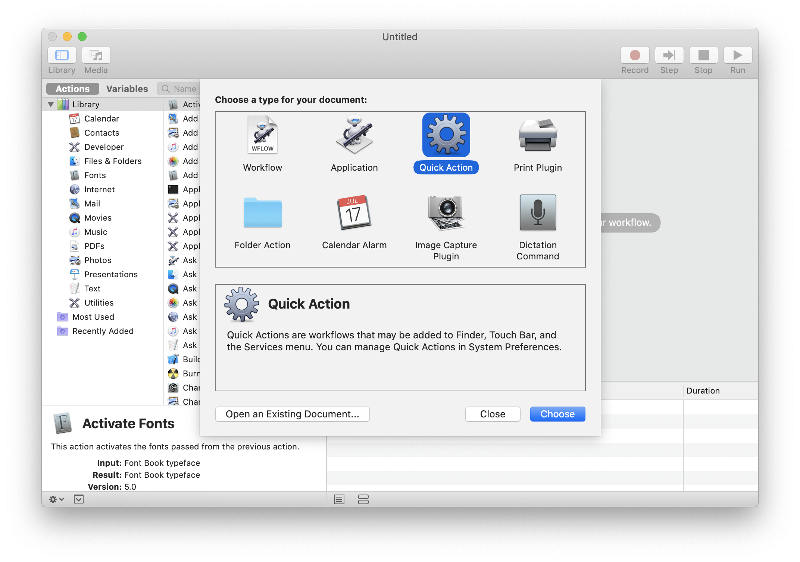
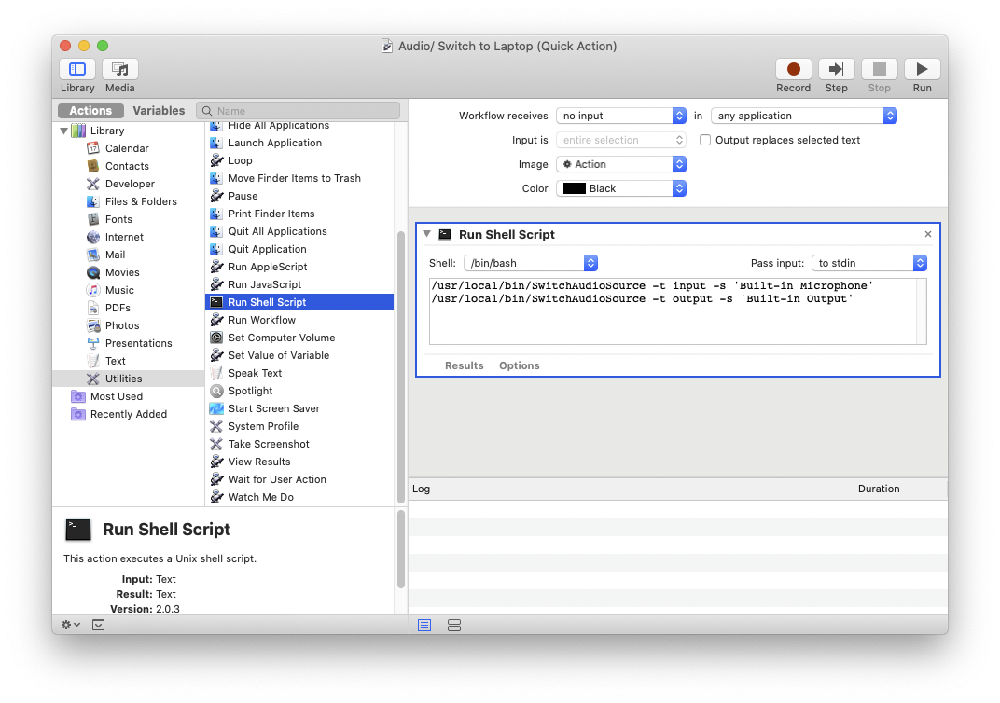
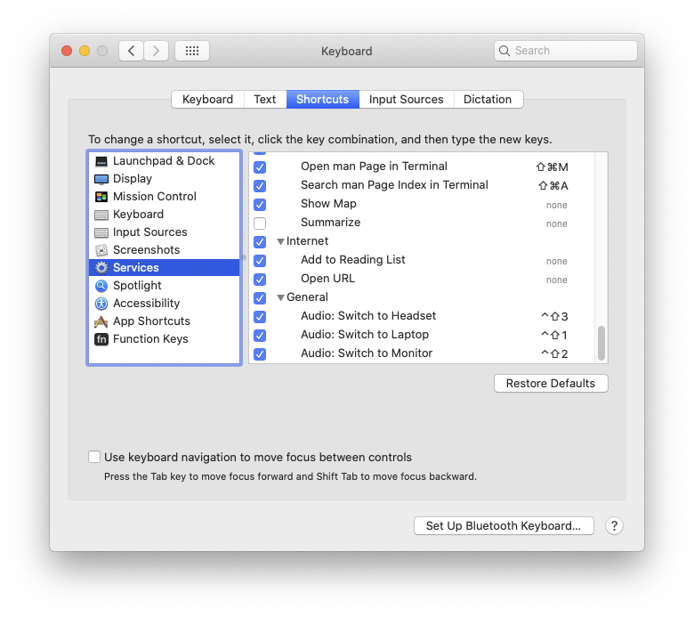
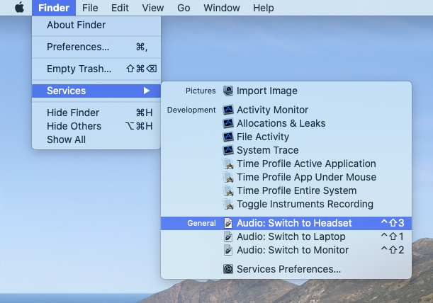

As part of the recent switch to work from home, I researched ways to improve my audio
quality when talking in meetings and interviews. As a result, I invested in a wireless
headphone with attached microphone. Other options included dedicated microphones, but I
didn't feel those were as necessary.

Now it felt a bit cumbersome to have to manually toggle between output devices. So this
weekend I spent some time to set up keyboard shortcuts to help switch between all the
options. Here are the 3 steps needed (using switchaudio-x and Automator), along with a
sample of what my Automator setup looks like.

I was surprised that my operating system (OS X) actually had a lot of the pieces ready
to go -- Automator and Keyboard Shortcuts are well-integrated, for example -- though I
still needed to install a small piece of software to bring everything together.

## 1. Create Automator services, one for each input/output set that I want to quickly access

1. Install [switchaudio-x](https://github.com/deweller/switchaudio-osx)
2. Run `$ SwitchAudioSource -a` to see the device names recognized by the tool
3. Create a series of Automator services (I made one for each device I wanted to switch to) that will run the above as shell commands
4. Automator has several modes. We'll use "Quick Action" and change the "Workflow receives" dropdown to `no input`:

The "Run" button helped me test that each of the services works as intended, so I knew I
was on the right track!

Note that my `SwitchAudioSource` directory might not be the same as yours. Run
`$ which SwitchAudioSource` to customize the path as is appropriate for you. In
my case, it's `/usr/local/bin/SwitchAudioSource`.

~~~
" Service 1: 'Audio/ Switch to Laptop'
/usr/local/bin/SwitchAudioSource -t input -s 'Built-in Microphone'
/usr/local/bin/SwitchAudioSource -t output -s 'Built-in Output'

" Service 2: 'Audio/ Switch to Monitor'
/usr/local/bin/SwitchAudioSource -t input -s 'Built-in Microphone'
/usr/local/bin/SwitchAudioSource -t output -s 'DisplayPort'

" Service 3: 'Audio/ Switch to Headset'
/usr/local/bin/SwitchAudioSource -t input -s 'HyperX Cloud Flight Wireless Headset'
/usr/local/bin/SwitchAudioSource -t output -s 'HyperX Cloud Flight Wireless Headset'
~~~

Source: [Switch Audio Outputs with a Keyboard Shortcut on OS X](http://apetronix.com/switch-audio-outputs-with-a-keyboard-shortcut-on-os-x/)

## 2. Assign hotkeys to those Automator services
Next, I went to OS X's `System Preferences \ Keyboard \ Shortcuts` to set up keyboard-based
activation of each service.

In my case, I used Ctrl-Shift-1, Ctrl-Shift-2, and Ctrl-Shift-3 for each script:

An alternative is to use a single hotkey to initiate a menu, and use a mouse/numbers to
select one of the configurations. However, I opted for the faster option without a menu.

Source: [How To Assign Keyboard Shortcuts To AppleScript and Automator Actions](https://blog.fosketts.net/2010/08/09/assign-keyboard-shortcut-applescript-automator-service/)

## 3. (Workaround for a Mac OS X bug) Manually invoke those services from the Finder menu

Finally, everything looked like it was ready to go, but the hotkeys don't seem to do anything.
It turned out that I needed to open `Finder \ Services` first before the keyboard shortcuts
could activate.

Source: [Keyboard shortcuts not working for services](https://discussions.apple.com/thread/5048120)

Another workaround is to use hotkeys that have the Cmd modifier key. See more on
that in [this StackExchange answer](https://apple.stackexchange.com/a/337176).

## 4. (Optional) Configuring for AirPods

In the case of AirPods, if they're not yet paired (e.g. because they're
currently paired to a phone), then it's possible that the Automator script will
fail. They can be instead toggled via a bluetooth-based script, as seen from
[this Reddit answer](https://www.reddit.com/r/MacOS/comments/i4czgu/big_sur_airpods_script/gck3gz3/):

~~~
use framework "IOBluetooth"
use scripting additions

set AirPodsName to "AirPods"

on getFirstMatchingDevice(deviceName)
	repeat with device in (current application's IOBluetoothDevice's pairedDevices() as list)
		if (device's nameOrAddress as string) contains deviceName then return device
	end repeat
end getFirstMatchingDevice

on toggleDevice(device)
	if not (device's isConnected as boolean) then
		device's openConnection()
		return "Connecting " & (device's nameOrAddress as string)
	else
		device's closeConnection()
		return "Disconnecting " & (device's nameOrAddress as string)
	end if
end toggleDevice

return toggleDevice(getFirstMatchingDevice(AirPodsName))
~~~

## Z. Appendix: what I Googled

1. "mac hotkey change output device": the apetronix link was the second result, though I also read through several
   other results from macrumors, stackexchange, and personal blog posts.
    1. A stackexchange article (third result) showed me how to use Automator as an easier approach to AppleScript:
       [Is it possible to make a hotkey for switching audio 
       output?](https://apple.stackexchange.com/questions/258028/is-it-possible-to-make-a-hotkey-for-switching-audio-output)
    2. A personal blog post, [Switching your Mac’s audio output device with a keyboard 
       shortcut](https://javenmsp.wordpress.com/2016/09/01/switching-your-macs-audio-output-device-with-a-keyboard-shortcut/),
       showed an example of having a single hotkey with number-based menus to toggle between separate devices,
       though I ended up not doing this
2. The keyboard-to-Automator setup was directly mentioned from the apetronix link. However, it's a bit buried.
3. "osx services hotkey not working" helped surface the final bug workaround

